<div align="center">

<a href="https://github.com/aby639/my-gallery">
  
</a>

<br>


<br>

<a href="mailto:sunnyvarghese25007@gmail.com">
  
</a>
<a href="https://www.linkedin.com/in/aby639">
  
</a>
<a href="https://github.com/aby639">
  
</a>


</div>

---

## Flagship build: MemoLens

<table>
  <tr>
    <td width="58%">
      <h3>MemoLens - local-first memory gallery</h3>
      <p>
        A private memory gallery app built with Expo, React Native and TypeScript. It is designed around fast capture, clean browsing and personal organisation, with Google sign-in, captions, moods, tags, favourites, search, sharing and EAS updates.
      </p>
      <p>
        This is the project I want people to notice first because it connects product thinking, mobile UI, authentication, local storage and release workflow in one app.
      </p>
      <p>
        <a href="https://github.com/aby639/my-gallery"><strong>Open MemoLens repo</strong></a>
      </p>
    </td>
    <td width="42%" align="center">
      <a href="https://github.com/aby639/my-gallery">
        
      </a>
      <br><br>
      
      <br>
      
      <br>
      
    </td>
  </tr>
</table>

<p align="center">
  
  
  
  
  
</p>

---

## Who I am

I am an MSc IT with Web Development student at UWS Paisley, building practical software with Python, Django, FastAPI, React, React Native, TypeScript, SQL and REST APIs.

I like the middle space where backend logic, databases and frontend experience meet: designing models, building CRUD/API workflows, connecting interfaces to services, testing endpoints and turning rough ideas into working products.

```txt
Current mode   : turning portfolio projects into polished product proof
Strongest area : Python backends + React/React Native frontends
Building next  : cleaner demos, better READMEs, stronger UI systems
Open to        : full-stack, Python, Django, React and software roles
```

---

## Product stack

<div align="center">


</div>

---

## Projects worth opening

<div align="center">

<a href="https://github.com/aby639/my-gallery">
  
</a>

</div>

| Project | Focus | Stack |
|---|---|---|
| [MemoLens](https://github.com/aby639/my-gallery) | Local-first private memory gallery with capture, captions, tags, favourites, search, sharing and updates. | Expo, React Native, TypeScript, AsyncStorage, Google Sign-In |
| [Product Explorer](https://github.com/aby639/product-explorer) | Full-stack product scraping and browsing with normalised product data. | Next.js, NestJS, TypeScript, PostgreSQL, Playwright |
| [RAG News Chatbot](https://github.com/aby639/RAG-Powered-Chatbot-for-News-Websites) | News Q&A app using retrieval, embeddings, citations and session flow. | React, Express, Qdrant, Jina, Gemini, Redis |
| [KPA Backend API](https://github.com/aby639/kpa-assignment) | Backend APIs for structured submissions and validation. | FastAPI, PostgreSQL, SQLAlchemy, Pydantic, Postman |

---

## GitHub signal

<table>
  <tr>
    <td><strong>28+</strong> public repositories</td>
    <td><strong>Mobile</strong> apps with Expo and React Native</td>
    <td><strong>Backend</strong> APIs with Python, Django and FastAPI</td>
  </tr>
  <tr>
    <td><strong>Full stack</strong> product builds</td>
    <td><strong>AI/RAG</strong> experiments with grounded answers</td>
    <td><strong>Portfolio</strong> moving toward live demos and cleaner docs</td>
  </tr>
</table>

---

## Currently levelling up

```txt
Mobile apps        Expo, React Native, local-first UX
Backend systems    FastAPI, Django, PostgreSQL, REST APIs
Frontend polish    React, TypeScript, animation, design systems
AI products        RAG flows, embeddings, practical AI assistants
```

<div align="center">

<strong>Building useful products, sharpening the details and making every project look more real than the last one.</strong>

</div>
