<div align="center">

<a href="https://github.com/aby639/my-gallery">
  
</a>

<br>


<br>

<a href="mailto:sunnyvarghese25007@gmail.com">
  
</a>
<a href="https://www.linkedin.com/in/aby639">
  
</a>
<a href="https://github.com/aby639">
  
</a>


</div>

---

## Hello visitor

<div align="center">



</div>

---

## Main quest: MemoLens

<table>
  <tr>
    <td width="58%">
      <h3>Private memory gallery with product polish</h3>
      <p>
        MemoLens is the build I want people to notice first: a local-first memory gallery app built with Expo, React Native and TypeScript.
      </p>
      <p>
        It brings together capture, clean browsing, captions, moods, tags, favourites, search, sharing, Google sign-in and EAS updates. For me, it is the project where mobile UI, product thinking, auth, local storage and release workflow all meet.
      </p>
      <p>
        <a href="https://github.com/aby639/my-gallery"><strong>Open the MemoLens repo</strong></a>
      </p>
    </td>
    <td width="42%" align="center">
      
      <br>
      
      <br>
      
      <br>
      
    </td>
  </tr>
</table>

---

## Build identity

```txt
Name           : Aby Daniel Varghese
Focus          : Full-stack development, mobile apps, APIs and AI tools
Education      : MSc IT with Web Development, UWS Paisley (expected 2027)
Current energy : Turn portfolio projects into polished product proof
Open to        : full-stack, Python, Django, React and software roles
```

I like the middle space where backend logic, databases and frontend experience meet: designing models, building CRUD/API workflows, connecting interfaces to services, testing endpoints and making rough ideas feel like real products.

---

## Product loadout

<div align="center">


</div>

---

## Build radar

<div align="center">

<a href="https://github.com/aby639/my-gallery">
  
</a>

</div>

| Project | Why it matters | Stack |
|---|---|---|
| [MemoLens](https://github.com/aby639/my-gallery) | Flagship local-first private memory gallery with capture, captions, tags, favourites, search, sharing and updates. | Expo, React Native, TypeScript, AsyncStorage, Google Sign-In |
| [Product Explorer](https://github.com/aby639/product-explorer) | Full-stack product scraping and browsing with normalised product data. | Next.js, NestJS, TypeScript, PostgreSQL, Playwright |
| [RAG News Chatbot](https://github.com/aby639/RAG-Powered-Chatbot-for-News-Websites) | News Q&A app using retrieval, embeddings, citations and session flow. | React, Express, Qdrant, Jina, Gemini, Redis |
| [KPA Backend API](https://github.com/aby639/kpa-assignment) | Backend APIs for structured submissions and validation. | FastAPI, PostgreSQL, SQLAlchemy, Pydantic, Postman |

---

## System console

<div align="center">



</div>

---

## Contribution flow

<div align="center">

<picture>
  <source media="(prefers-color-scheme: dark)" srcset="https://raw.githubusercontent.com/aby639/aby639/output/github-contribution-grid-snake-dark.svg" />
  <source media="(prefers-color-scheme: light)" srcset="https://raw.githubusercontent.com/aby639/aby639/output/github-contribution-grid-snake.svg" />
  
</picture>

</div>

---

## What I am levelling up

```txt
Mobile products   Expo, React Native, local-first UX, release workflow
Backend systems   FastAPI, Django, PostgreSQL, REST APIs
Frontend polish   React, TypeScript, animation, design systems
AI products       RAG flows, embeddings, useful assistant workflows
```

<div align="center">

<strong>Building useful products, sharpening the details and making every project look more real than the last one.</strong>

</div>
