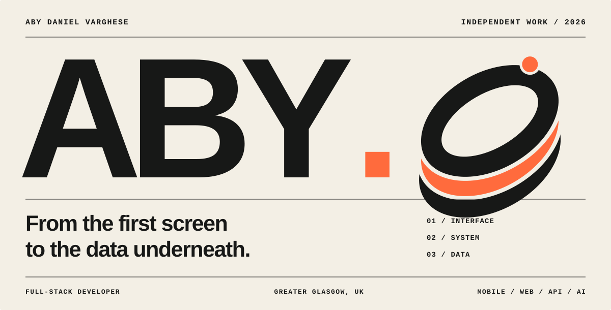
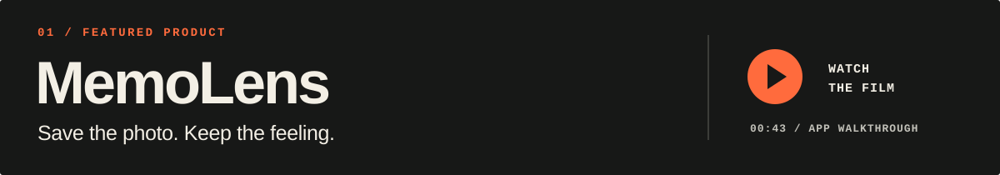
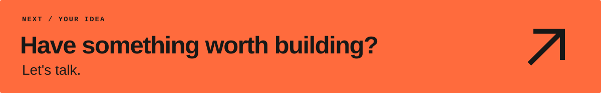

<a href="https://aby-portfolio-gules.vercel.app">
  <picture>
    <source media="(max-width: 640px)" srcset="./assets/aby-editorial-hero-mobile.svg" />
    
  </picture>
</a>

  <a href="https://aby-portfolio-gules.vercel.app"><strong>EXPLORE MY PORTFOLIO ↗</strong></a>
  &nbsp;&nbsp; / &nbsp;&nbsp;
  <a href="https://www.youtube.com/watch?v=bV9s-qFNM9c">MEMOLENS FILM ↗</a>
  &nbsp;&nbsp; / &nbsp;&nbsp;
  <a href="mailto:sunnyvarghese25007@gmail.com">GET IN TOUCH ↗</a>

 

I'm **Aby**, a full-stack developer based in Greater Glasgow and an MSc IT with Web Development student at the University of the West of Scotland. I build mobile apps, websites and the APIs behind them.

My work ranges from a photo journal with voice memories to product-data pipelines and websites for imagined local businesses. I enjoy connecting the visible details to the logic underneath: the screen, the model, the request and what happens when something fails.

 

### A photo is only part of a memory.

**MemoLens** keeps a photo together with its caption, mood, tags and an optional voice note. Start privately, build a collection on your device, then find a memory by the story around it.

The current app has a dark interface, favourites, search and voice-note filters. Native Android and iOS builds support voice recording; the video walks through the web-rendered app with demonstration memories. The app is currently for personal use and testing.

**Expo · React Native · TypeScript · AsyncStorage**

[Watch the walkthrough ↗](https://www.youtube.com/watch?v=bV9s-qFNM9c) &nbsp; · &nbsp; [Explore the source ↗](https://github.com/aby639/my-gallery) &nbsp; · &nbsp; [Read the case study ↗](https://aby-portfolio-gules.vercel.app/work/memolens)

 

## 02 / Websites with a point of view

Independent portfolio concepts, each built around a different kind of visitor. These screenshots show the latest local builds; linked live demos may show earlier revisions.

<table>
  <tr>
    <td width="50%" valign="top">
      
      <h3>ClydeCraft</h3>
      
A Glasgow trades concept: project photography, a material selector and a guided quote flow.

      <a href="https://clydecraft-trades-demo.vercel.app">Explore live site ↗</a>
    </td>
    <td width="50%" valign="top">
      
      <h3>Alderwick House</h3>
      
A care-home concept with warm design, clear visiting information and accessible interactions.

      <a href="https://care-home-template.vercel.app">Explore live site ↗</a>
    </td>
  </tr>
  <tr>
    <td width="50%" valign="top">
      
      <h3>Cairn House</h3>
      
A Highland retreat concept with an architectural scroll story and an image-led atmosphere.

      <a href="https://cairn-house-retreat-demo.vercel.app">Explore live site ↗</a>
    </td>
    <td width="50%" valign="top">
      
      <h3>Morrow Studio</h3>
      
A salon concept with a spatial introduction, editorial film and an interactive style selector.

      <a href="https://aby-portfolio-gules.vercel.app/work/morrow-studio">Read case study ↗</a>
    </td>
  </tr>
</table>

 

## 03 / Under the interface

### [RAG News Chatbot ↗](https://github.com/aby639/RAG-Powered-Chatbot-for-News-Websites)

Article ingestion, vector retrieval, cited answers and session history.  
**React · Express · Qdrant · Gemini · Redis**

### [Product Data Explorer ↗](https://github.com/aby639/product-explorer)

Product extraction, normalisation and browsing APIs.  
**Next.js · NestJS · TypeScript · PostgreSQL**

### [ScentMatch AI ↗](https://github.com/aby639/ScentMatch-AI-)

A catalogue-grounded fragrance assistant with structured tools and deterministic matching.  
**Python · Google ADK · Gemini · Streamlit**

 

## 04 / The tools behind the work

**Interfaces** &nbsp; React · React Native · Next.js · TypeScript · Motion · GSAP  
**Services & data** &nbsp; Python · Django · FastAPI · NestJS · PostgreSQL · Redis  
**Workflow** &nbsp; Git · Docker · Postman · Playwright · Jest · Vitest

 

I'm open to software development roles and conversations about useful products.

[Email ↗](mailto:sunnyvarghese25007@gmail.com) &nbsp; · &nbsp; [Connect on LinkedIn ↗](https://www.linkedin.com/in/aby639) &nbsp; · &nbsp; [Portfolio ↗](https://aby-portfolio-gules.vercel.app)

