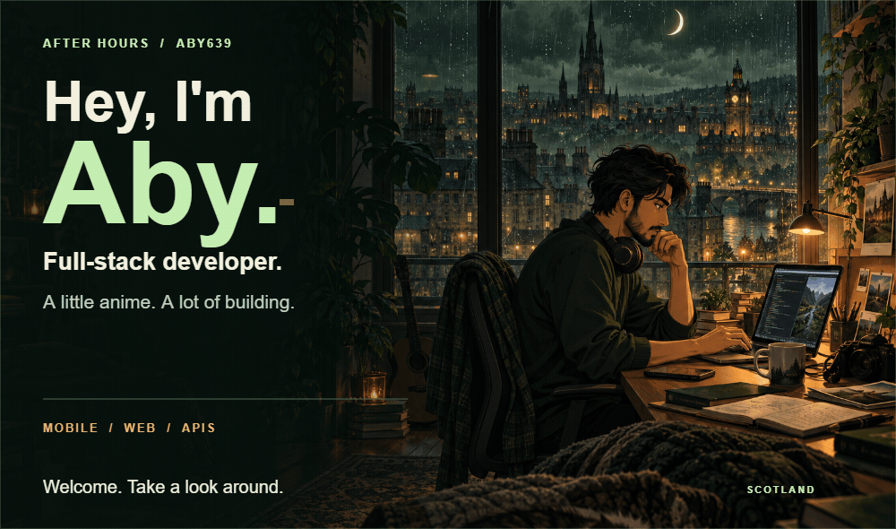
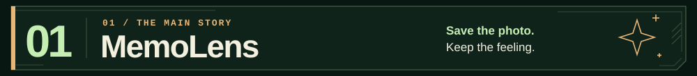
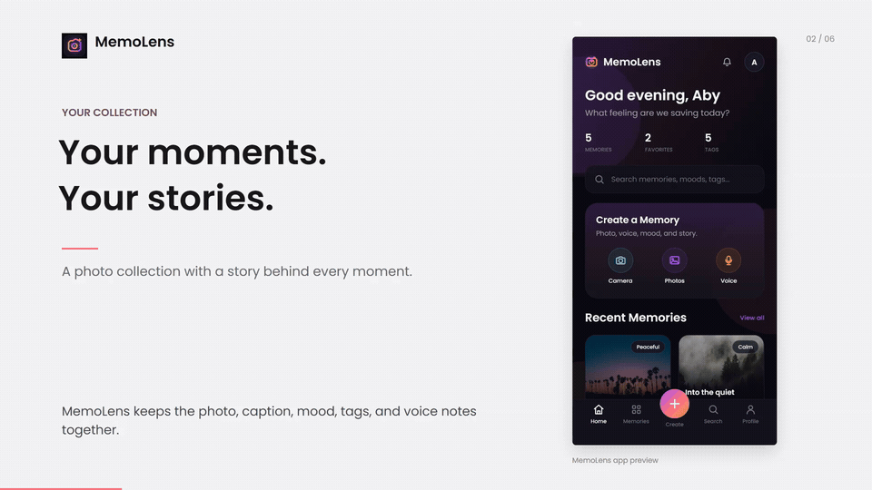
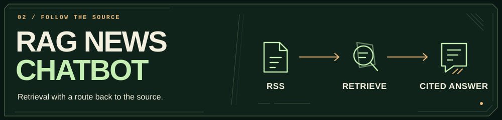
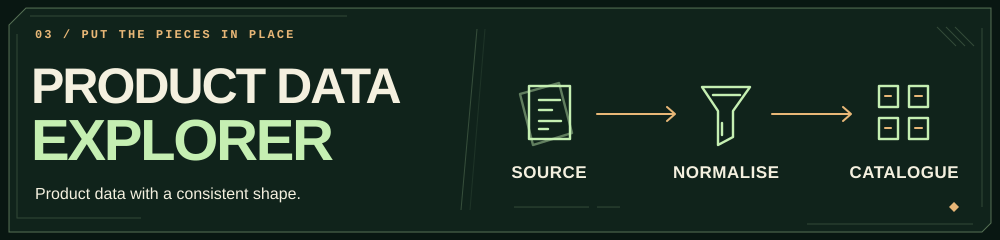
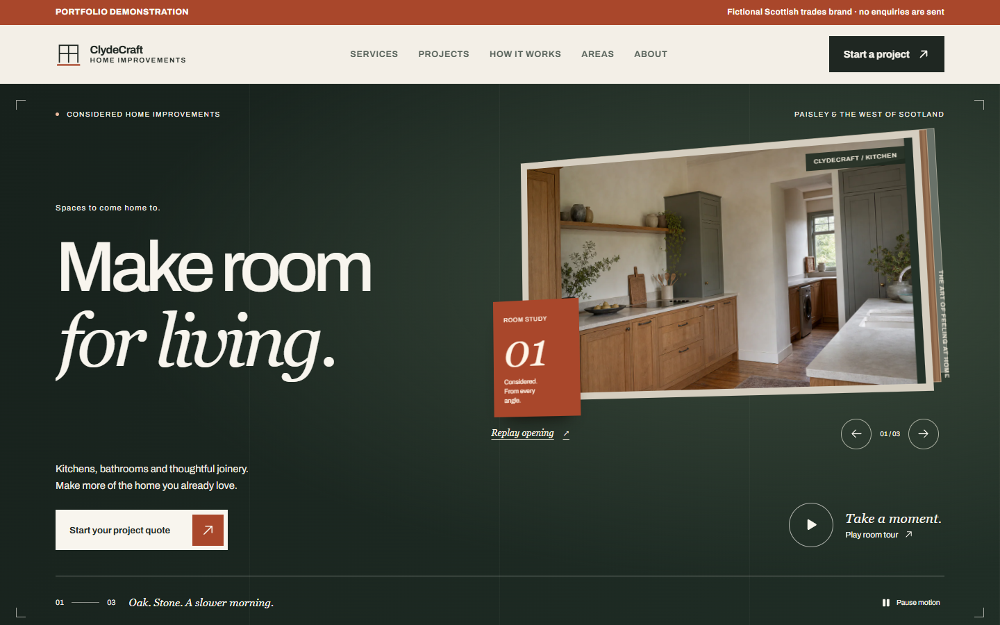
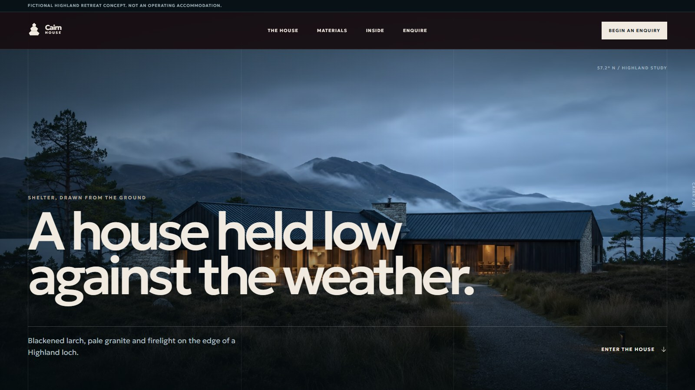
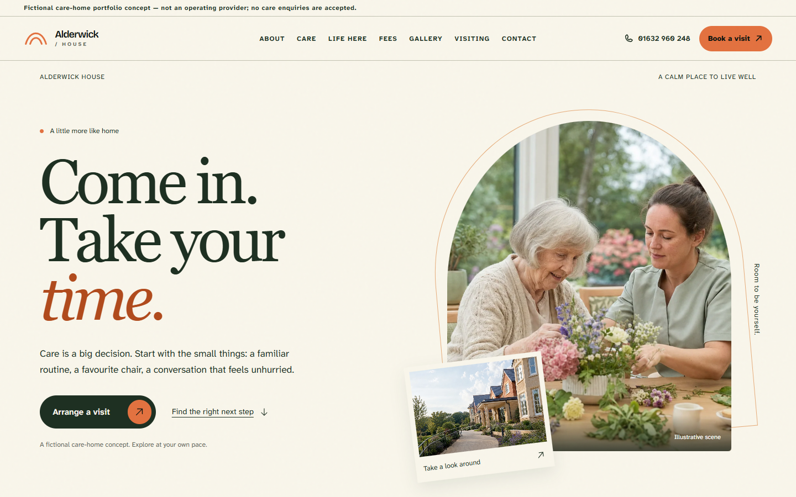
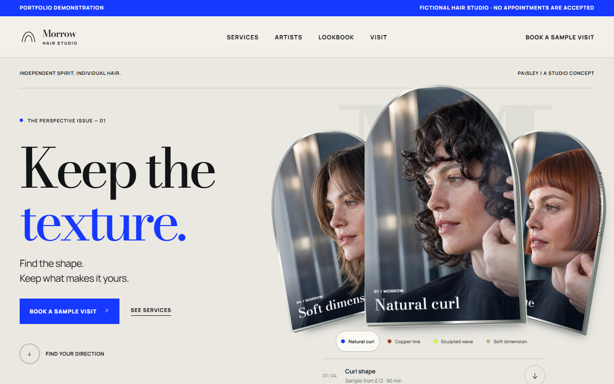
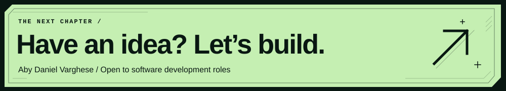

<a href="https://aby-portfolio-gules.vercel.app">
  <picture>
    <source media="(prefers-reduced-motion: reduce) and (max-width: 640px)" srcset="./assets/after-hours/welcome-mobile-still.png" />
    <source media="(prefers-reduced-motion: reduce)" srcset="./assets/after-hours/welcome-still.png" />
    <source media="(max-width: 640px)" srcset="./assets/after-hours/welcome-mobile.gif" />
    
  </picture>
</a>

  <a href="https://aby-portfolio-gules.vercel.app"><strong>PORTFOLIO ↗</strong></a>
  &nbsp; · &nbsp;
  <a href="https://www.linkedin.com/in/aby639"><strong>LINKEDIN ↗</strong></a>
  &nbsp; · &nbsp;
  <a href="https://aby-portfolio-gules.vercel.app/cv/Aby-Daniel-Varghese-CV.pdf"><strong>CV ↓</strong></a>
  &nbsp; · &nbsp;
  <a href="mailto:sunnyvarghese25007@gmail.com"><strong>EMAIL ↗</strong></a>

### Welcome to my corner of GitHub.

I'm **Aby Daniel Varghese**, a full-stack developer in Scotland and an MSc Information Technology with Web Development student at **UWS**. I build mobile apps, websites and the APIs behind them. I love anime, thoughtful interfaces and figuring out how things work.

Right now, I'm working on **MemoLens** and a collection of web experiences. Take a look around—the demos, source code and stories behind the projects are linked below.

 

### MemoLens · A photo is only part of a memory.

Keep the photo, caption, mood, tags and an optional voice note together. **MemoLens** is a photo journal with on-device storage, favourites and search by caption, mood or tag.

<a href="https://www.youtube.com/watch?v=bV9s-qFNM9c">
  <picture>
    <source media="(prefers-reduced-motion: reduce)" srcset="./assets/after-hours/memolens-film-preview-static.png" />
    
  </picture>
</a>

**[▶ Watch the full film](https://www.youtube.com/watch?v=bV9s-qFNM9c)** &nbsp; · &nbsp; [Source code](https://github.com/aby639/my-gallery) &nbsp; · &nbsp; [The case study](https://aby-portfolio-gules.vercel.app/work/memolens)

**React Native · Expo · TypeScript · AsyncStorage** 
Personal/testing build. Voice recording runs on native Android and iOS; the film shows the web-rendered app with demonstration memories.

 

## 02 / Other stories I'm building

**[RAG News Chatbot ↗](https://github.com/aby639/RAG-Powered-Chatbot-for-News-Websites)** 
Article ingestion, vector retrieval, cited answers and session history. 
React · Express · Qdrant · Gemini · Redis

**[Product Data Explorer ↗](https://github.com/aby639/product-explorer)** 
A product browser with layered extraction, PostgreSQL storage and refresh handling. 
Next.js · NestJS · TypeScript · PostgreSQL

**[ScentMatch AI ↗](https://github.com/aby639/ScentMatch-AI-)** 
A fragrance assistant with catalogue-grounded matching and structured Python tools. 
Python · Google ADK · Gemini · Streamlit

<strong>Explore four website worlds ↗</strong>

 

Independent portfolio concepts for imagined businesses, each with a different visual identity.

**[ClydeCraft](https://aby-portfolio-gules.vercel.app/work/clydecraft)** — a trades website with a material selector and guided sample quote.

**[Cairn House](https://aby-portfolio-gules.vercel.app/work/cairn-house)** — an architectural scroll story for a Highland retreat concept.

**[Alderwick House](https://aby-portfolio-gules.vercel.app/work/alderwick-house)** — a care-home concept with accessible navigation and clear visiting information.

**[Morrow Studio](https://aby-portfolio-gules.vercel.app/work/morrow-studio)** — an editorial salon concept with an interactive style selector and sample booking.

 

## 03 / The toolkit

**Interfaces** &nbsp; React · React Native · Next.js · TypeScript 
**Services & data** &nbsp; Python · Django · FastAPI · NestJS · PostgreSQL · Redis 
**Motion & testing** &nbsp; Motion · GSAP · Playwright · Jest · Vitest 
**Day to day** &nbsp; Git · Docker · Postman

 

## 04 / A little after-hours energy

Anime is part of the inspiration here. The welcome scene is an original illustration made for this profile; the clip below is a small fan corner.

<strong>▶ Open the anime corner — Naruto & Sasuke</strong>

 

<picture>
  <source media="(prefers-reduced-motion: reduce)" srcset="./assets/after-hours/naruto-sasuke-supplied-static.png" />
  
</picture>

An excerpt from a clip I shared while putting this profile together. Naruto footage belongs to its respective creators and rights holders.

<strong>↳ Watch my contribution snake</strong>

 

<picture>
  <source media="(prefers-reduced-motion: reduce)" srcset="./assets/after-hours/contributions-still.png" />
  <source media="(prefers-color-scheme: dark)" srcset="https://raw.githubusercontent.com/aby639/aby639/output/github-contribution-grid-snake-dark.svg" />
  
</picture>

 

I'm open to **software development roles** and conversations about useful products.

[Email](mailto:sunnyvarghese25007@gmail.com) &nbsp; · &nbsp; [LinkedIn](https://www.linkedin.com/in/aby639) &nbsp; · &nbsp; [Portfolio](https://aby-portfolio-gules.vercel.app) &nbsp; · &nbsp; [CV](https://aby-portfolio-gules.vercel.app/cv/Aby-Daniel-Varghese-CV.pdf)
